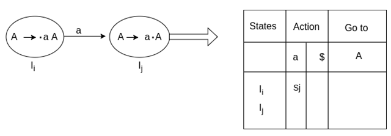
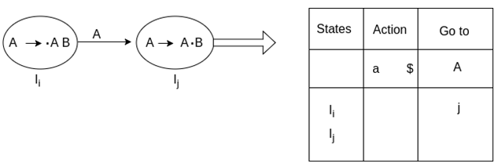
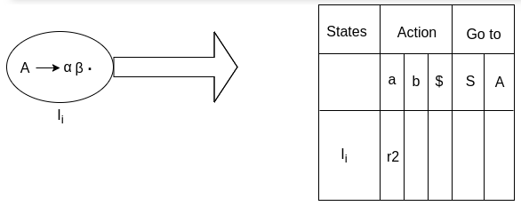
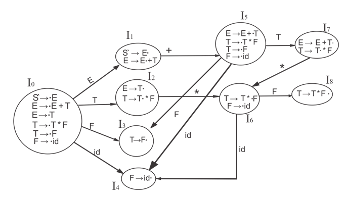
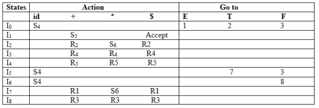

**Introduction**

In computer science, a Simple LR or SLR parser is a type of LR parser with small parse tables and a relatively simple parser generator algorithm. As with other types of LR(1) parser, an SLR parser is quite efficient at finding the single correct bottom-up parse in a single left-to-right scan over the input stream, without guesswork or backtracking. The parser is mechanically generated from a formal grammar for the language.
SLR and the more-general methods LALR parser and Canonical LR parser have identical methods and similar tables at parse time; they differ only in the mathematical grammar analysis algorithms used by the parser generator tool. SLR and LALR generators create tables of identical size and identical parser states. SLR generators accept fewer grammars than do LALR generators like yacc and Bison. Many computer languages don't readily fit the restrictions of SLR, as is. Bending the language's natural grammar into SLR grammar form requires more compromises and grammar hackery. So LALR generators have become much more widely used than SLR generators, despite being somewhat more complicated tools. SLR methods remain a useful learning step in college classes on compiler theory.
 
**SLR (1) Table Construction**

The steps which use to construct SLR (1) Table is given below:
If a state (Ii) is going to some other state (Ij) on a terminal then it corresponds to a shift move in the action part.

If a state (Ii) is going to some other state (Ij) on a variable then it correspond to go to move in the Go to part.

If a state (Ii) contains the final item like A → ab• which has no transitions to the next state then the production is known as reduce production. For all terminals X in FOLLOW (A), write the reduce entry along with their production numbers.

**Example**

S -> •Aa   
A->αβ•   
Follow(S) = {$}  
Follow (A) = {a}  

**SLR ( 1 ) Grammar**

S → E
E → E + T | T
T → T * F | F
F → id

Add Augment Production and insert '•' symbol at the first position for every production in G

S` → •E
E → •E + T
E → •T
T → •T * F
T → •F
F → •id

I0 State:

Add Augment production to the I0 State and Compute the Closure

I0 = Closure (S` → •E)

Add all productions starting with E in to I0 State because "." is followed by the non-terminal. So, the I0 State becomes

I0 = S` → •E
        
E → •E + T

E → •T

Add all productions starting with T and F in modified I0 State because "." is followed by the non-terminal. So, the I0 State becomes.

I0= S` → •E
   	E → •E + T
   	E → •T
   	T → •T * F
   	T → •F
   	F → •id
    
I1= Go to (I0, E) = closure (S` → E•, E → E• + T)

I2= Go to (I0, T) = closure (E → T•T, T• → * F)

I3= Go to (I0, F) = Closure ( T → F• ) = T → F•

I4= Go to (I0, id) = closure ( F → id•) = F → id•

I5= Go to (I1, +) = Closure (E → E +•T)

Add all productions starting with T and F in I5 State because "." is followed by the non-terminal. So, the I5 State becomes

I5 = E → E +•T

T → •T * F

T → •F

F → •id

Go to (I5, F) = Closure (T → F•) = (same as I3)

Go to (I5, id) = Closure (F → id•) = (same as I4)

I6= Go to (I2, *) = Closure (T → T * •F)

Add all productions starting with F in I6 State because "." is followed by the non-terminal. So, the I6 State becomes

I6 = T → T * •F
     	
F → •id

Go to (I6, id) = Closure (F → id•) = (same as I4)

I7= Go to (I5, T) = Closure (E → E + T•) = E → E + T•

I8= Go to (I6, F) = Closure (T → T * F•) = T → T * F•

Drawing DFA:

SLR (1) Table

 
Ref: 

	[Simple_LR_parser](https://en.wikipedia.org/wiki/Simple_LR_parser)
  
	[slr-1-parsing](https://www.javatpoint.com/slr-1-parsing)
